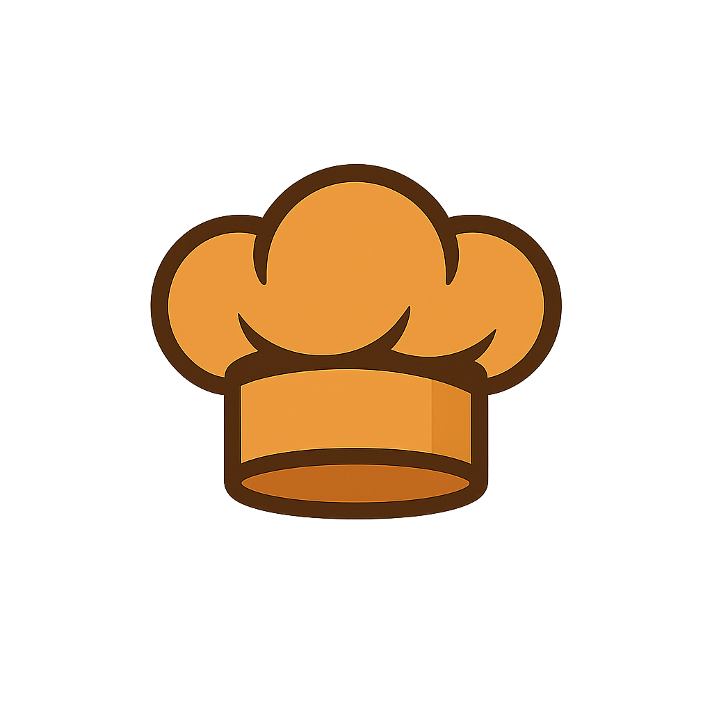
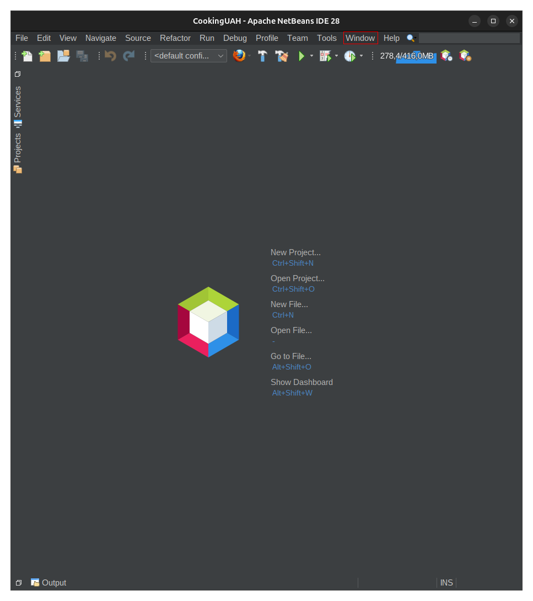

# Cooking UAH

## Aplicación web desarrollada en el marco de la PL2 de la asignatura Arquitectura y Diseño de Sistemas Web y C/S para el curso 2025-26

Proyecto *Web Application* Maven desarrollado en Netbeans 28 con **JDK 24**

## Proceso para crear la BBDD del proyecto

> 1. Buscar en la barra de herramientas de Netbeans: 'Window > Service' (CRTL + 5).

> 2. Acceder a 'Databases/Java DB'. Hacer clic derecho sobre 'Java DB' y elegir 'Create Database' con el nombre *CookingUAH* y usuario *root* y contraseña *root*.

Hasta ahora hemos creado la Base de Datos *CookingUAH*, pero está vacía.

> 3. Buscar 'jdbc:derby.../CookingUAH'. Hacer clic derecho sobre ello y elegir 'Execute Command...'.

Se abre una ventana y aquí debemos seleccionar el fichero *Tablas2.sql* que se localiza en 'CookingUAH/SQL/'. Se copia y se pega en esta nueva ventana.
Ahora, en la parte superior derecha de la ventana, hacemos clic en el primer icono empezando por la izquierda *Run SQL* o pulsamos *CNTRL+SHIFT+E*.

En este punto, nuestra Base de Datos ya no está vacía de tablas, pero sí de contenido. Esto nos permite comenzar a registrar usuarios

Validador de html: https://validator.w3.org/
 Avatares:https://www.istockphoto.com/es/ilustraciones/character?page=2
 

https://lapalmerarosa.com/tacos-mexicanos-de-ternera/ 
https://www.instagram.com/p/CEaJYiEKGDd/
https://www.nestlecocina.es/receta/brownie-de-chocolate-negro
https://lacocinadefrabisa.lavozdegalicia.es/ensalada-completa/
https://www.facebook.com/alansergi98/posts/im%C3%A1genes-de-goku-para-tu-foto-de-perfil-/1018251176971364/
https://printler.com/es/poster/181300/
https://hellokitty.fandom.com/wiki/Hello_Kitty
